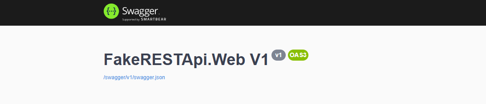
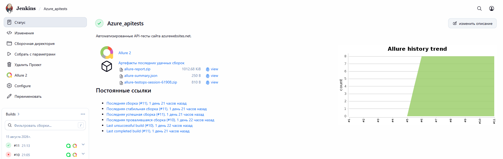
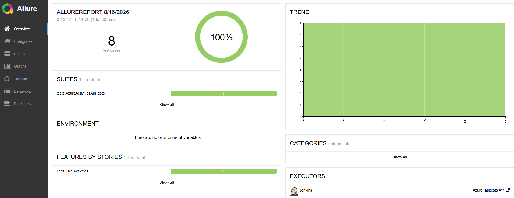
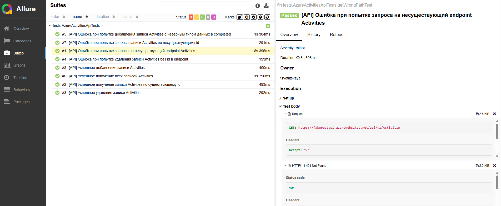
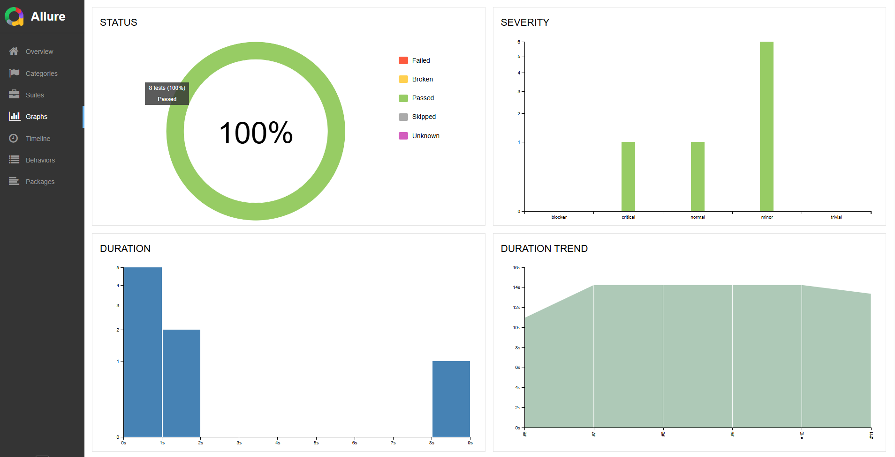
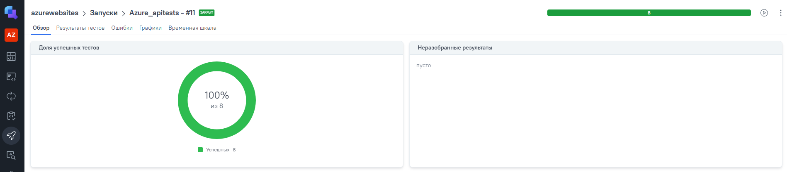
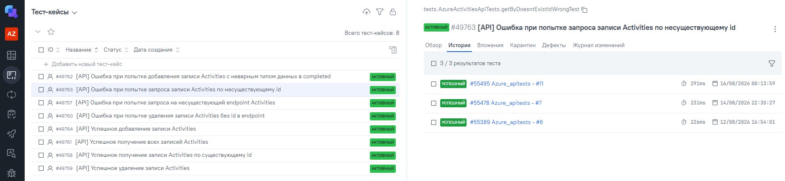
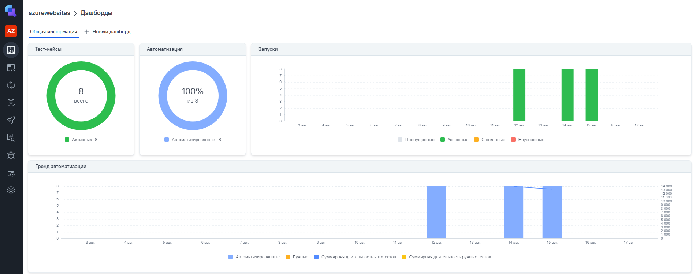
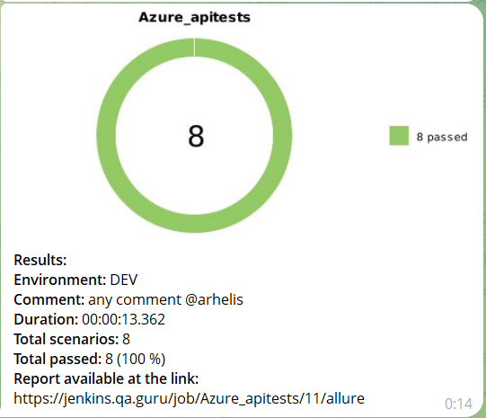

# Проект по автоматизации тестирования API для сайта [azurewebsites](https://fakerestapi.azurewebsites.net/index.html)

> Открытый Swagger для API автотестов

## ☑️ Содержание:

- Технологии и инструменты
- Список проверок, реализованных в тестах
- Запуск тестов (сборка в Jenkins) 
- Allure-отчет
- Интеграция с Allure TestOps
- Уведомление в Telegram о результатах прогона тестов

## :ballot_box_with_check:Технологии и инструменты:

| Java                                                                                                      | IntelliJ     Idea                                                                                               | GitHub                                                                                                     | JUnit 5                                                                                                           | Gradle                                                                                                     | Selenide                                                                                                         | Selenoid                                                                                                                  | Allure   Report                                                                                                         |  Jenkins                                                                                                        |   Jira                                                                                                              | Telegram                                                                                                            |Allure   TestOps                                                                                                          
|:----------------------------------------------------------------------------------------------------------|--------------------------------------------------------------------------------------------------------------------|------------------------------------------------------------------------------------------------------------|-------------------------------------------------------------------------------------------------------------------|------------------------------------------------------------------------------------------------------------|------------------------------------------------------------------------------------------------------------------|---------------------------------------------------------------------------------------------------------------------------|----------------------------------------------------------------------------------------------------------------------------|-----------------------------------------------------------------------------------------------------------------|---------------------------------------------------------------------------------------------------------------------|---------------------------------------------------------------------------------------------------------------------|----------------------------------------------------------------------------------------------------------------------------------:|
|   |  |  |  |  |  |  |  | |  |  | |

## :ballot_box_with_check: Реализованные проверки:

- Позитивный тест - Успешное добавление записи Activities
- Позитивный тест - Успешное получение записи Activities по существующему id
- Позитивный тест - Успешное получение всех записей Activities
- Позитивный тест - Успешное удаление записи Activities
- Негативный тест - Ошибка при попытке добавления записи Activities с неверным типом данных в completed
- Негативный тест - Ошибка при попытке запроса записи Activities по несуществующему id
- Негативный тест - Ошибка при попытке запроса на несуществующий endpoint Activities
- Негативный тест - Ошибка при попытке удаления записи Activities без id в endpoint

##  Сборка в [Jenkins](https://jenkins.qa.guru/job/Azure_apitests/)

  
  

## :ballot_box_with_check: Параметры сборки в Jenkins:

- ENVIRONMENT: DEV/TEST/PRELIVE/PROD
- BASE_URI (ссылка на ресурс)
- COMMENT (комментарий для уведомления телеграмбота)

## </a>  Allure Report	</a>

## Основная страница отчёта

  
  

  

## Сьюты

  
  

## Graphs

  
  

##  </a>Интеграция с Allure TestOps</a>

## Allure TestOps

  
  

 

## Allure TestOps Запуски

  
  

 

## Allure TestOps Дашборды

  
  

 

____
## </a> Уведомление в Telegram при помощи бота
____

  
  

